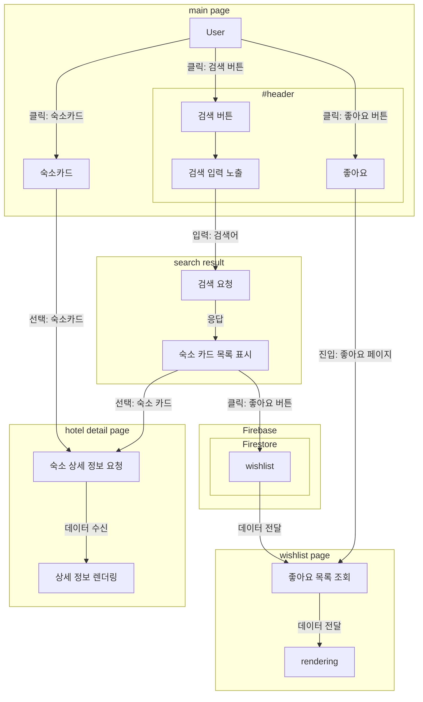
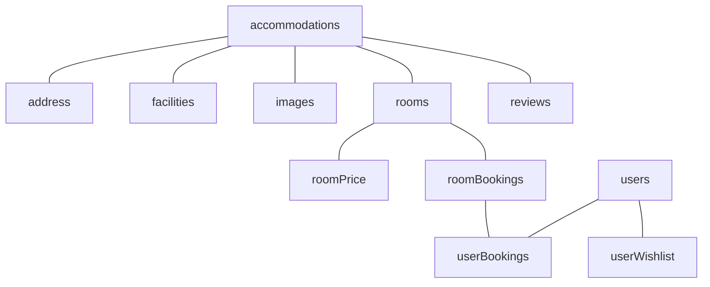
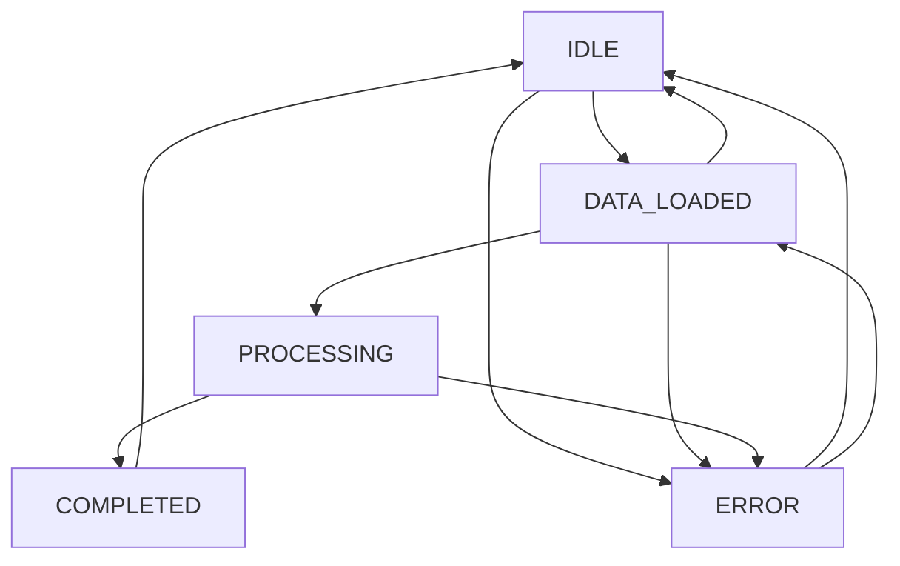

<p align="center">
  <h1 align="center">숙박 예약 앱</h1>
  <h4 align="center">React와 Firebase를 활용한 숙박 예약 서비스</h4>
</p>

<b><i><p align="center">EST soft, FE 4기, 2조</p></i></b>

## 팀원

<table>
  <tr>
    <th>이름</th>
    <th>역할</th>
  </tr>
  <tr>
    <td align="center"><a href="https://github.com/jadewisemann">정유진</a></td>
    <td align="center">팀장</td>
  </tr>
  <tr>
    <td colspan="2">
      <ul>
        <li>형상 관리
        <li>Commit · Coding Convention 관리
        <li>문서 관리 및 배포 담당
        <li>컴포넌트 로직 구현
        <li>공통 컴포넌트 구현
        <li>메인 페이지 및 찜한 숙소 페이지 개발
      </ul>
    </td>
  </tr>
  <tr>
    <td align="center"><a href="#">김석용</a></td>
    <td align="center">팀원</td>
  </tr>
  <tr>
    <td colspan="2">
      <ul>
        <li>공통 컴포넌트 개발
      </ul>
    </td>
  </tr>
  
  <tr>
    <td align="center"><a href="https://github.com/kib09">김인배</a></td>
    <td align="center">팀원</td>
  </tr>
  <tr>
    <td colspan="2">
      <ul>
        <li>공통 컴포넌트(main-header ...) 제작 및 구현
        <li>검색 결과 페이지 개발
        <li>API 연동 및 검색 기능 개발
        <li>API 핸들링 기능 구현
      </ul>
    </td>
  </tr>
  
  <tr>
    <td align="center"><a href="https://github.com/choroc">오초록</a></td>
    <td align="center">팀원</td>
  </tr>
  <tr>
    <td colspan="2">
      <ul>
        <li>프로젝트 목표 설정 및 진행 관리
        <li>기획 및 전체 일정 관리
        <li>디자인 및 와이어프레임 제작
        <li>숙소 정보 상세 페이지 개발
        <li>공통 컴포넌트 제작 및 구현
      </ul>
    </td>
  </tr>
  
  <tr>
    <td align="center"><a href="#">한은혁</a></td>
    <td align="center">팀원</td>
  </tr>
  <tr>
    <td colspan="2">
      <ul>
        <li>서버 성능 개선
      </ul>
    </td>
  </tr>
</table>

## 프로젝트 개요

- 숙박예약 앱 구성
- 회원가입 기능
- 검색 기능
- 찜하기
- 결제 기능 구성
- mobile-first 디자인

## 개발 환경


[](https://discord.com/)


### 프론트엔드
- HTML 5
- JavaScript
- React v19
- Tailwind CSS v4

### 백엔드/데이터베이스
- Firebase
  - Firestore
  - Firebase Functions
  - Firebase Authentication

### 프로젝트 관리
- 형상관리: `github`
- 일정 관리: `discord`
- 지식 관리: `github wiki`
- 이슈/태스크 관리: `github project (kanban)`

## 기능 요구사항

### 필수 기능
- [x] 회원가입/로그인
- [x] 숙소 검색
- [x] 숙소 상세 정보 조회
- [x] 찜하기
- [x] 예약 및 결제

### 선택 기능
- [x] 다크 모드
- [x] 포인트 시스템
- [x] 반응형 디자인
- [x] 예약 내역 확인
- [x] 로컬 스토리지를 활용한 상태 관리

## 주요 기술 구현

### 데이터 수집 (크롤링)
- Python, Beautiful Soup, Selenium을 활용한 웹 스크래핑
- 전국 9개 지역의 숙소 정보 수집

### 상태 관리 (Zustand)
- 간결한 상태 구현
- 로컬 스토리지 연동 (persist)
- FSM(Finite State Machine) 패턴 적용한 결제 프로세스

### 모달 및 토스트 알림
- React Portal을 활용한 독립적 렌더링
- 전역 및 지역 상태 분리로 렌더링 최적화

### 라우팅
- public/private 라우팅 구현
- 인증 상태에 따른 경로 보호

### 스타일링
- Tailwind CSS 활용
- 다크 모드 지원

## 프로젝트 구조
```
📦 root
┣━ 📦 public           # 정적 파일
┃   ┣━ 📦 images       # 이미지 자산
┃   ┗━ 📜 index.html   # 진입점 HTML
┣━ 📦 src              # 소스코드
┃   ┣━ 📦 components   # 재사용 가능한 컴포넌트
┃   ┣━ 📦 hooks        # 커스텀 훅
┃   ┣━ 📦 pages        # 페이지 컴포넌트
┃   ┣━ 📦 store        # Zustand 상태 관리
┃   ┣━ 📦 utils        # 유틸리티 함수
┃   ┣━ 📦 services     # API 서비스
┃   ┣━ 📦 routes       # 라우팅 설정
┃   ┗━ 📜 App.jsx      # 앱 진입점
┣━ 📦 firebase         # Firebase 설정 및 함수
┃   ┣━ 📦 functions    # Firebase Cloud Functions
┃   ┗━ 📜 config.js    # Firebase 설정
┣━ 📦 scripts          # 빌드 및 개발 스크립트
┃   ┗━ 📦 crawler      # 데이터 크롤링 스크립트
┗━ 📦 docs             # 문서 (컨벤션 및 API 예제)
```

## 데이터 흐름



## 기능 구현 세부 사항

### Firebase Firestore 데이터베이스 구조


### 결제 상태 관리 (FSM)


## 배포 링크
[사이트 바로가기](https://your-deployment-link.com)
