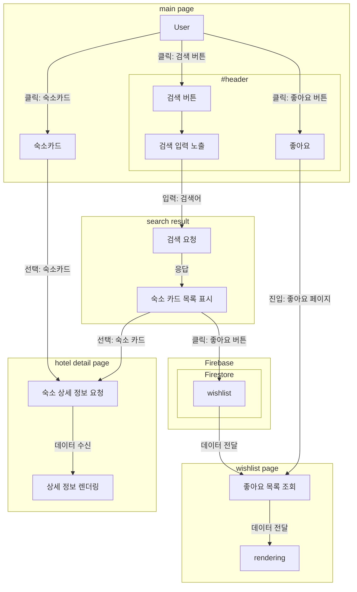
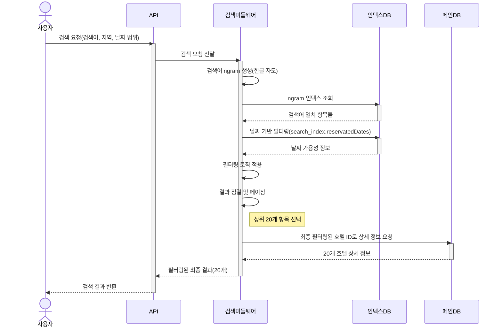
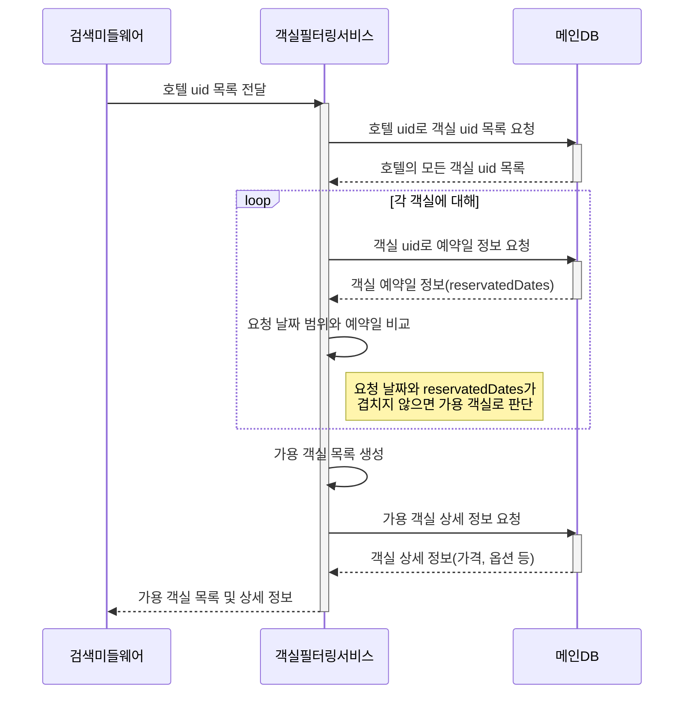
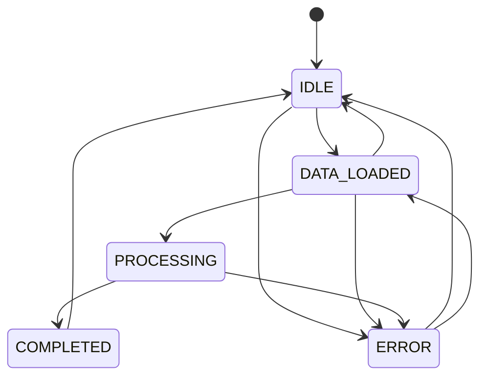
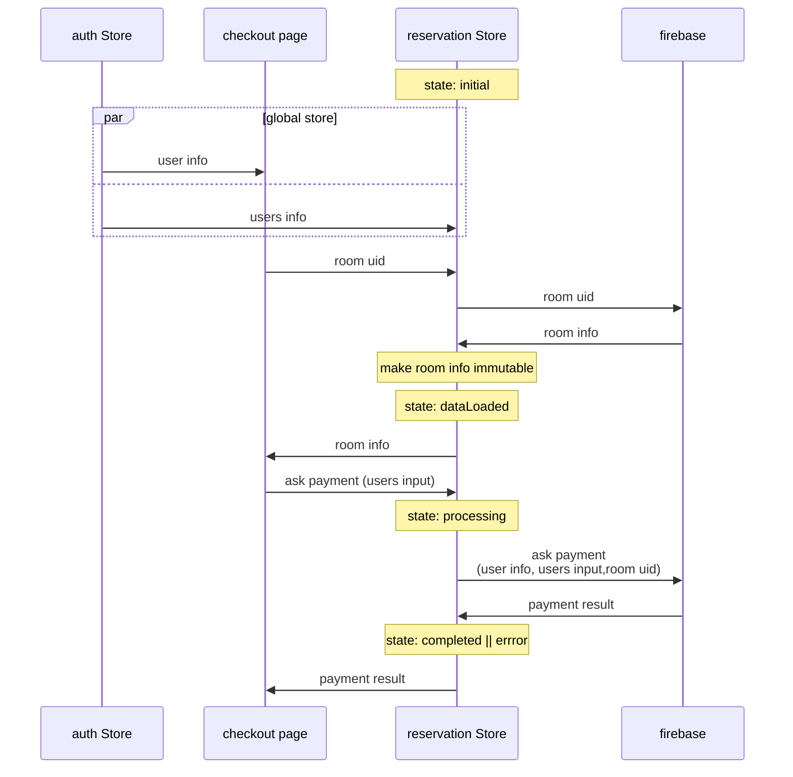
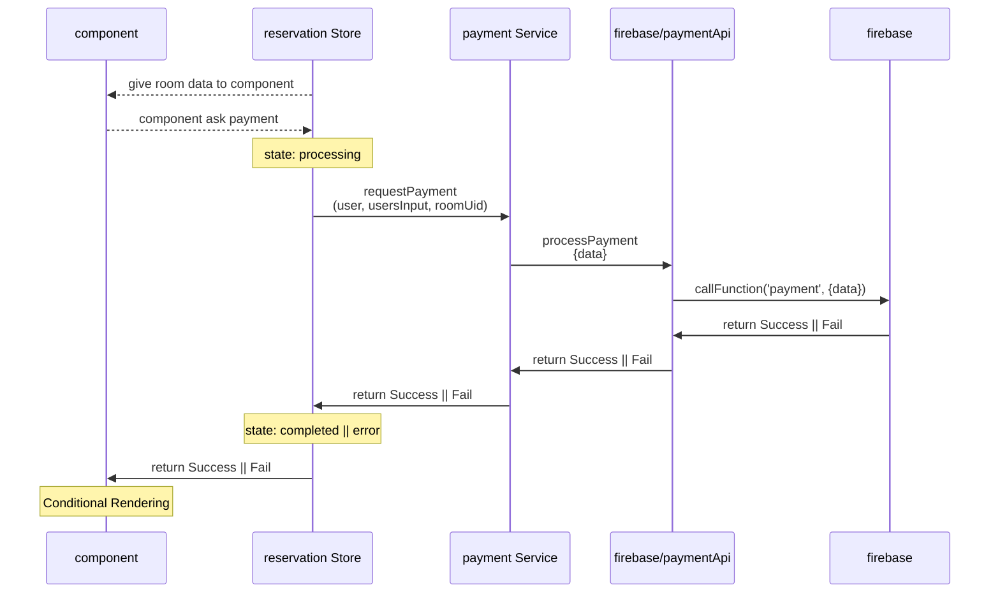
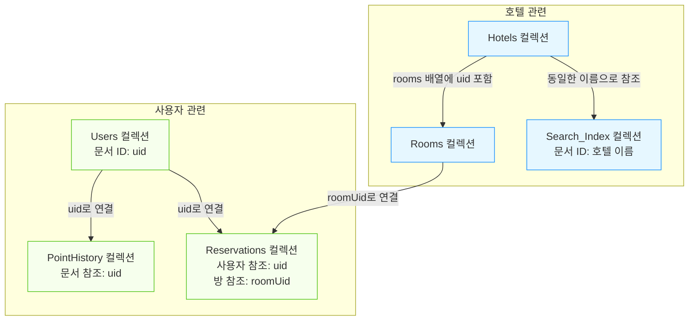
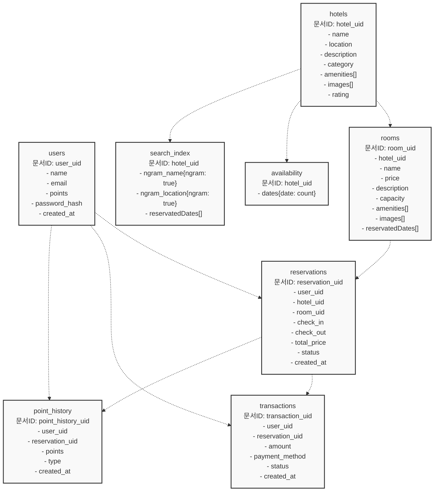

<p align="center">
  
</p>

<b><i><p align="center">EST soft, FE 4기, 2조</p></i></b>

## 팀원

| 역할 | 이름 | 주요 업무 |
|------|------|-----------|
| 팀장 | 정유진 | <ul><li>PM</li><li>User flow 설계</li><li>데이터 크롤 설계 - db 구조, api</li><li>비즈니스 로직 구현 - db, 유저 정보, 결제 서비스, 위시리스트</li><li>형상 관리 및 컨벤션 제정</li><li>발표 및 ppt 제작</li><li>eslint, prettier 등 개발 환경 관리 및 초기 세팅</li><li>Component - modal, calendar, button, counter</li></ul> |
| 팀원 | 김석용 | <ul><li>공통 컴포넌트 분리</li></ul> |
| 팀원 | 김인배 | <ul><li>Component - input, toast, skeleton, heart, loading</li><li>Page - login, signup, find-password</li><li>Protect route 및 private route 구현</li><li>토스트 프로바이더 구현</li><li>인풋 검증 로직 구현</li></ul> |
| 팀원 | 오초록 | <ul><li>UI design</li><li>Component - Nav, Tab, Complete, DetailSection, Horizontal list</li><li>Page - main page, search-result, my-page</li></ul> |
| 팀원 | 한은혁 | <ul><li>Component - checkbox, icon, radio, rating, verticallist</li><li>Page - details, checkout, reservation-detail, wishlist</li><li>다크 모드 구현 (로컬 스토리지 및 시스템 설정)</li><li>웹 표준 및 html 오류 수정</li></ul> |


## 프로젝트 개요

- 숙박예약 앱 구성
- 회원가입 기능
- 검색 기능
- 찜하기
- 결제 기능 구성
- mobile-first 디자인

## 개발 환경


- HTML 5
- JavaScript
- React v19
- Tailwind CSS v4

### 의존성


- zustand
- react-router
- react-icon
- swiper

### formatting


- eslint
- prettier

### BAAS


- Firebase
  - Firestore
  - Firebase Functions
  - Firebase Authentication
  
### 프로젝트 관리


[](https://discord.com/)

- 형상관리: `github`
- 지식 관리: `github wiki`
- 일정 관리: `discord`
- 이슈/태스크 관리: `github project (kanban)`

### 데이터 크롤


- python
  - BS4
  - selenium


## 기능 요구사항


### 필수 기능
- [x] 회원인증
  - [x] 기본정보 가입 (이메일, 비밀번호, 이름)
  - [x] 로그인
  - [x] 회원가입

- [x] 전체 상품 목록 조회
  - [x] 데이터 베이스에서 상품 목록을 가져옵니다.
  - [x] 이미지, 상품명, 상품가격을 기본으로 출력합니다.
  - [x] 재고에 따라 출력여부를 결정합니다.
  - [x] 페이징을 만듭니다.
  
- [x] 상품 옵션
  - [x] 상세소개 페이지에서 상품 옵션을 선택.
  - [x] 날짜, 여행인원
 
- [x] 결제하기
  - [x] 주문 페이지에서 로직 및 주문 처리
  - [x] 데이터베이스에 주문 정보를 저장합니다.
  
- [x] 주문결과확인
  - [x] 결제를 성공적으로 처리하면 주문한 상품결과를 출력합니다.

### 선택 기능
- [x] 카테고리를 분류하여 상품을 출력합니다.
- [x] 장바구니 담기 => 위시리스트
  - [x] 체크박스를 통해 상품을 선택/제외합니다.
  - [ ] 주문하기 버튼으로 결제화면으로 이동합니다.
- [x] 주문내역확인
  - [x] 별도 주문 내역페이지에 주문한 이력을 출력합니다.  

### 추가 기능
- [x] 다크 모드
- [x] 포인트 시스템
- [x] 반응형 디자인
- [x] 로컬 스토리지를 활용한 상태 관리
- [x] 로그인 없이 위시리스트 구현
- [x] 프로텍트, 퍼블릭 라우트

## 주요 기능 설명

### 매인 페이지
<table>
  <tr>
    <td></td>
    <td></td>
    <td></td>
  </tr>
</table>

- 검색 기능
- 추천 호텔 및 카테고리 바로 가기 가능
- 캘린더 모달로 날짜 선택
- 사람수 선택택 모달

### 검색 결과 페이지
<table>
  <tr>
    <td></td>
    <td></td>
    <td></td>
  </tr>
</table>

- 검색어로 검색결과
- 검색 모달로 검색 가능
- 상단에 탭을 눌러 카테고리 필터링
  
### 관심 숙소

<table>
  <tr>
    <td></td>
    <td></td>
  </tr>
</table>


- 검색 결과에서 하트를 눌러 관심숙소에 추가 가능
- 관심숙소 페이지에 저장됨
- 로컬로 저장했다가 로그인하면 반영
  
### 로그인


<table>
  <tr>
    <td></td>
    <td></td>
    <td></td>
  </tr>
</table>

- 입력 검증
- 서버 측 로그인 검증증

### 회원가입

<table>
  <tr>
    <td></td>
    <td></td>
    <td></td>
  </tr>
</table>

- 입력 검증
- 서버 측 로그인 검증증
- 회원가입시 자동 로그인 및 라우팅팅

### 상세 페이지
<table>
  <tr>
    <td></td>
    <td></td>
    <td></td>
  </tr>
</table>


### 결제 페이지

<table>
  <tr>
    <td></td>
    <td></td>
    <td></td>
  </tr>
</table>


- 입력 값에 따라 결제 검증 및 제출
- 서버에 예약 내역 기록
  
### 마이페이지


- 유저 정보 확인 가능
- 다크모드 가능

### 예약 상세

<table>
  <tr>
    <td></td>
    <td></td>
    <td></td>
  </tr>
</table>


- 서버에서 예약 내역 가져오서 상세 확인

### 다크모드

<table>
  <tr>
    <td></td>
    <td></td>
    <td></td>
  </tr>
</table>


- 마이페이지에서 다크모드 
  - 시스템 설정이랑 로컬 스토리지 확인해서 구현현

## 주요 기술 구현

### 데이터 수집 (크롤링)

- Python, Beautiful Soup, Selenium을 활용한 웹 스크래핑
- 전국 9개 지역의 숙소 정보 수집 (각 100개씩, 900개)

### 상태 관리 (Zustand)

- 간결한 상태 구현
- 로컬 스토리지 연동 (persist)
- FSM(Finite State Machine) 패턴과 세션 스토리지를 적용한 결제 프로세스
  - side-effect 방지

### 모달 및 토스트 알림

- React Portal을 활용한 독립적 렌더링
- 전역 및 지역 상태 분리로 렌더링 최적화

### 라우팅

- public/private 라우팅 구현
- 인증 상태에 따른 경로 보호

### 스타일링

- Tailwind CSS 활용
  - **우수한 DX**
  - 성능 저하 없음 (CSS in Js)
  - 컴포넌트 설계에 적합 (CSS Module)
- 내장 기능(`dark:`)으로 다크 모드 간결하고 컴포넌트 단에서 구현

### 페이지네이션

- 모바일이라는 특성에 맞춰 무한 스크롤로 페이지 네이션 구현
- 최하단에 observer를 부착한 요소를 로딩 애니메이션(svg)로 배치
  - 로딩 애니메이션을 사용자가 보게되는 동시에 옵저버가 트리거되며 새로운 정보를 로딩


### 예약

- 예약 요청 검증 (client && firebase functions)
  - 사용자 정보, 객실 ID, 날짜, 결제 정보 등의 필수 입력값 검증
  - 날짜 형식 및 유효성 검증 (체크아웃 > 체크인)
- 객실 가용성 확인 (일반적으로는 검색에서 필터링되어 접근이 불가)
  - 요청된 날짜 범위에 해당 객실이 예약 가능한지 확인
  - 이미 예약된 날짜와 겹치는지 검증
- 트랜잭션 처리 
  - 예약 정보 생성 (reservations 컬렉션)
  - 객실 예약 상태 업데이트 (rooms.reservedDates)
  - 호텔 예약 가능 여부 카운터 업데이트 (availability.dates)
  - 검색 인덱스 갱신 (예약 가능 객실이 0개인 날짜는 search_index.reservedDates에 추가)
- 결제 및 포인트 처리
  - 사용자 포인트 차감 및 기록
  - 결제 트랜잭션 생성

### n-gram 인덱싱
- firestore는 no sql이라 전문 검색이 불가
- 호텔의 이름과 주소를 ngram으로 쪼개고 합쳐서 `combined_ngram`을 구성
- 상수시간 복잡도로 찾을수 있도록 객체에 ngram을 키로, 값은 모두 `true`로 할당하여 구상
- 호텔마다 n-gram이 있으면 호텔의 uid를 가지고 있음
  - 호텔은 호텔의 정보만 가지고 기타 예약 사항, 가격 정보는 search_index로 보내 추상화 및 쿼리 최적화
  
### 검색 (필터링)

- 검색 요청 처리
  - 검색어, 지역, 카테고리, 날짜 범위 등 조건 확인
  - 검색어 ngram 생성
- 날짜 기반 사전 필터링
  - 요청된 날짜 범위에 예약 불가능한 호텔 필터링
  - search_index.reservedDates 배열 활용
    - 여행 일정 사이의 모든 날 중 하나라도 reservedDate에 있으면 필터링
- 호텔 검색 처리
  - (검색 결과에서 이미 필터링된 호텔 제외)
  - 일반 조건 검색 (ngram, 지역, 카테고리)
- 예약 가능 객실 확인
  - 검색 결과 호텔 (적어도 1개 이상의 예약 가능한 방이 있음이 확인됨)의 모든 방을 조회
    - 호텔은 방의 uid를 가지고 있어 rooms 콜렉션을 uid로 조회
    - rooms안의 문서에 reservedDate가 여행 일정 사이에 있으면 필터링
- 검색 => 호텔 필터링 => 호텔 내에서 객실 필터링


### 성능 최적화 전략

- 캐싱 전략
  - 인메모리 캐시와 IndexedDB를 활용한 클라이언트 측 캐싱
- 데이터 구조 최적화
  - 모든 날을 생성하는 것이 아니라 예약된 날만 저장
    - 날짜 데이터를 배열이 아닌 객체 형태로 저장 (O(1) 접근 가능)
    - 데이터 크기 최소화 및 빠른 조회 가능
  - 검색 인덱스에 예약 불가 날짜만 저장하여 데이터 크기 최소화
- 트랜잭션 처리
  - 모든 데이터 변경 작업을 단일 트랜잭션으로 처리하여 일관성 유지
  - 예약 처리 시 원자적 업데이트 보장
- 효율적인 쿼리 설계  
  - 날짜 필터링을 검색 초기 단계에서 수행하여 처리할 데이터 최소화
  - 필요한 데이터만 정확하게 조회하는 쿼리 설계 

## 기능 구현 세부 사항

### 데이터 흐름



### 검색 필터링

#### 숙박 업체 필터링


#### 객실 필터링



### 결제 상태 관리 (FSM)



### reservation(payment) middle ware



### 결제 시퀀스



### firebase 통신


### Firebase Firestore 데이터베이스 구조






## 프로젝트 구조
```
📜eslint.config.js // eslint 설정 
📜index.html       // 진입 포인트
📜package.json     // 의존성
📦src              // 소스
 ┣ 📂assets        // 정적파일
 ┃ ┣ 📂ico         // 아이콘 
 ┃ ┗ 📂img         // 이미지 
 ┣ 📂components    // 컴포넌트
 ┣ 📂firebase      // firebase 관련 서비스
 ┣ 📂pages         // 페이지
 ┣ 📂routes        // 라우팅
 ┣ 📂services      // 서비스
 ┣ 📂store         // 스토어
 ┣ 📜App.css       // tailwind entry point
 ┣ 📜App.jsx       // react entry point
 ┣ 📜index.css  
 ┗ 📜main.jsx
```

## 배포 링크


