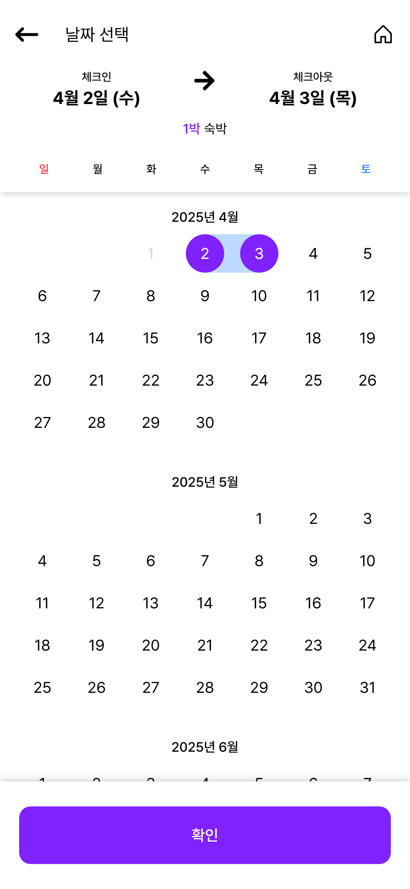
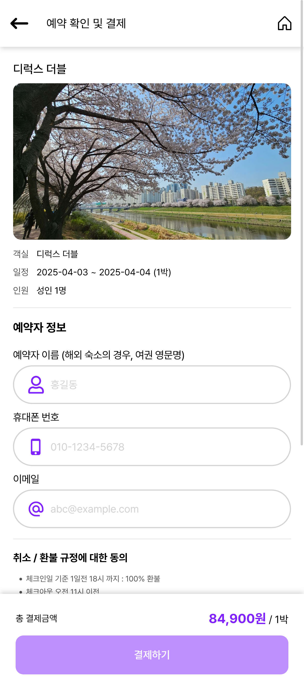
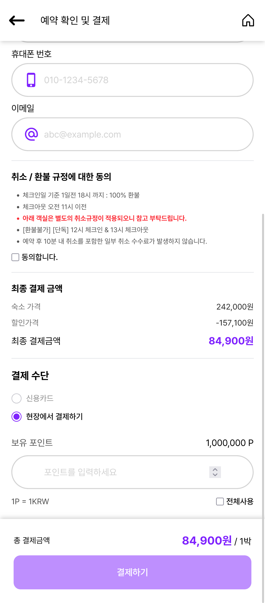
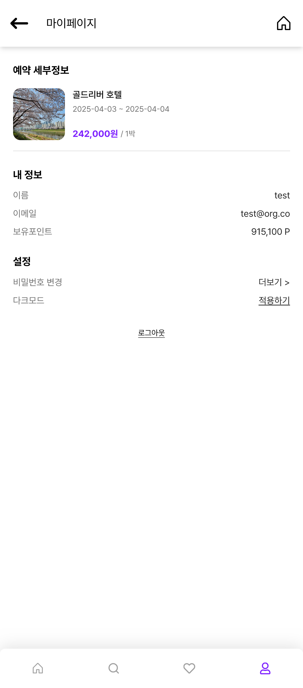
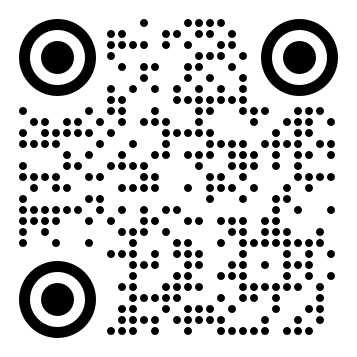

<p align="center">
  <h1 align="center">Pookjayo</h1>
  
</p>

<b><i><p align="center">EST soft, FE 4기, 2조</p></i></b>

## 팀원

| 역할 | 이름 | 주요 업무 |
|------|------|-----------|
| 팀장 | 정유진 | <ul><li>PM</li><li>User flow 설계</li><li>데이터 크롤 설계 - db 구조, api</li><li>비즈니스 로직 구현 - db, 유저 정보, 결제 서비스, 위시리스트</li><li>형상 관리 및 컨벤션 제정</li><li>발표 및 ppt 제작</li><li>eslint, prettier 등 개발 환경 관리 및 초기 세팅</li><li>Component - modal, calendar, button, counter</li></ul> |
| 팀원 | 김석용 | <ul><li>공통 컴포넌트 분리</li></ul> |
| 팀원 | 김인배 | <ul><li>Component - input, toast, skeleton, heart, loading</li><li>Page - login, signup, find-password</li><li>Protect route 및 private route 구현</li><li>토스트 프로바이더 구현</li><li>인풋 검증 로직 구현</li></ul> |
| 팀원 | 오초록 | <ul><li>UI design</li><li>Component - Nav, Tab, Complete, DetailSection, Horizontal list</li><li>Page - main page, search-result, my-page</li></ul> |
| 팀원 | 한은혁 | <ul><li>Component - checkbox, icon, radio, rating, verticallist</li><li>Page - details, checkout, reservation-detail, wishlist</li><li>다크 모드 구현 (로컬 스토리지 및 시스템 설정)</li><li>웹 표준 및 html 오류 수정</li></ul> |


## 프로젝트 개요

- 숙박예약 앱 구성
- 회원가입 기능
- 검색 기능
- 찜하기
- 결제 기능 구성
- mobile-first 디자인

## 개발 환경


- HTML 5
- JavaScript
- React v19
- Tailwind CSS v4

### 의존성


- zustand
- react-router
- react-icon
- swiper

### formatting


- eslint
- prettier

### BAAS


- Firebase
  - Firestore
  - Firebase Functions
  - Firebase Authentication
  
### 프로젝트 관리


[](https://discord.com/)

- 형상관리: `github`
- 지식 관리: `github wiki`
- 일정 관리: `discord`
- 이슈/태스크 관리: `github project (kanban)`

### 데이터 크롤


- python
  - BS4
  - selenium


## 기능 요구사항

### 필수 기능
- [x] 회원인증
  - [x] 기본정보 가입 (이메일, 비밀번호, 이름)
  - [x] 로그인
  - [x] 회원가입

- [x] 전체 상품 목록 조회
  - [x] 데이터 베이스에서 상품 목록을 가져옵니다.
  - [x] 이미지, 상품명, 상품가격을 기본으로 출력합니다.
  - [x] 재고에 따라 출력여부를 결정합니다.
  - [x] 페이징을 만듭니다.
  
- [x] 상품 옵션
  - [x] 상세소개 페이지에서 상품 옵션을 선택.
  - [x] 날짜, 여행인원
 
- [x] 결제하기
  - [x] 주문 페이지에서 로직 및 주문 처리
  - [x] 데이터베이스에 주문 정보를 저장합니다.
  
- [x] 주문결과확인
  - [x] 결제를 성공적으로 처리하면 주문한 상품결과를 출력합니다.

### 선택 기능
- [x] 카테고리를 분류하여 상품을 출력합니다.
- [x] 장바구니 담기 => 위시리스트
  - [x] 체크박스를 통해 상품을 선택/제외합니다.
  - [ ] 체크박스를 통해 상품을 선택/제외합니다.
  - [ ] 주문하기 버튼으로 결제화면으로 이동합니다.
- [x] 주문내역확인
  - [x] 별도 주문 내역페이지에 주문한 이력을 출력합니다.  

### 추가 기능
- [x] 다크 모드
- [x] 포인트 시스템
- [x] 반응형 디자인
- [x] 로컬 스토리지를 활용한 상태 관리
- [x] 로그인 없이 위시리스트 구현
- [x] 프로텍트, 퍼블릭 라우트

## 주요 기능 설명

### 매인 페이지





- 검색 기능
- 추천 호텔 및 카테고리 바로 가기 가능
- 캘린더 모달로 날짜 선택
- 사람수 선택택 모달

### 검색 결과 페이지


- 검색어로 검색결과
- 검색 모달로 검색 가능
- 상단에 탭을 눌러 카테고리 필터링
  
### 관심 숙소


- 검색 결과에서 하트를 눌러 관심숙소에 추가 가능
- 관심숙소 페이지에 저장됨
- 로컬로 저장했다가 로그인하면 반영
  
### 로그인


- 입력 검증
- 서버 측 로그인 검증증

### 회원가입


- 입력 검증
- 서버 측 로그인 검증증
- 회원가입시 자동 로그인 및 라우팅팅

### 상세 페이지


### 결제 페이지





- 입력 값에 따라 결제 검증 및 제출
- 서버에 예약 내역 기록
  
### 마이페이지


- 유저 정보 확인 가능
- 다크모드 가능

### 예약 상세




- 서버에서 예약 내역 가져오서 상세 확인

### 다크모드


- 마이페이지에서 다크모드 
  - 시스템 설정이랑 로컬 스토리지 확인해서 구현현

## 주요 기술 구현

### 데이터 수집 (크롤링)
- Python, Beautiful Soup, Selenium을 활용한 웹 스크래핑
- 전국 9개 지역의 숙소 정보 수집

### 상태 관리 (Zustand)
- 간결한 상태 구현
- 로컬 스토리지 연동 (persist)
- FSM(Finite State Machine) 패턴 적용한 결제 프로세스

### 모달 및 토스트 알림
- React Portal을 활용한 독립적 렌더링
- 전역 및 지역 상태 분리로 렌더링 최적화

### 라우팅
- public/private 라우팅 구현
- 인증 상태에 따른 경로 보호

### 스타일링
- Tailwind CSS 활용
- 다크 모드 지원


## 기능 구현 세부 사항

### 데이터 흐름


### reservation(payment) middle ware


### Firebase Firestore 데이터베이스 구조


### firebase 통신


### 결제 상태 관리 (FSM)


### 결제 시퀀스


## 프로젝트 구조
```
📜eslint.config.js // eslint 설정 
📜index.html       // 진입 포인트
📜package.json     // 의존성
📦src              // 소스
 ┣ 📂assets        // 정적파일
 ┃ ┣ 📂ico         // 아이콘 
 ┃ ┗ 📂img         // 이미지 
 ┣ 📂components    // 컴포넌트
 ┣ 📂firebase      // firebase 관련 서비스
 ┣ 📂pages         // 페이지
 ┣ 📂routes        // 라우팅
 ┣ 📂services      // 서비스
 ┣ 📂store         // 스토어
 ┣ 📜App.css       // tailwind entry point
 ┣ 📜App.jsx       // react entry point
 ┣ 📜index.css  
 ┗ 📜main.jsx
```

## 배포 링크


