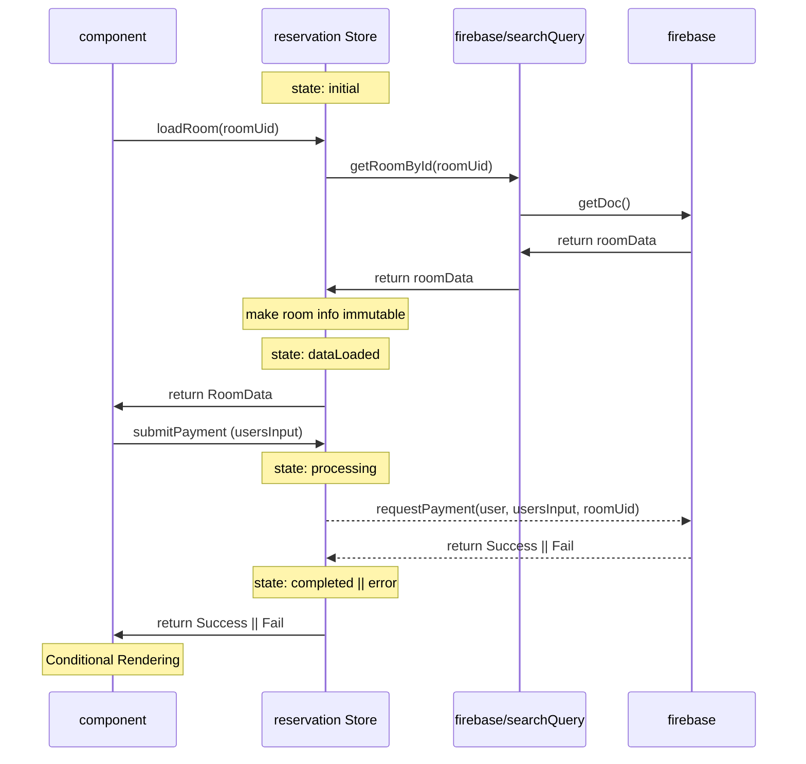

# getRoomData

## sequence diagram

[mermaid live](https://mermaid.live/edit#pako:eNqNk02P2jAQhv-K5RNIKU1DEiCHPXRRpZWqqgX1UuUysQewGtupP1alLP-9dtgAK1TUHKI4fuadecfjA2WaI62oxV8eFcOlgK0BWSsSng6ME0x0oBxpCFjCtOy0QuVu91ncN2jRPIMTWpG10wZvOYzcRhhswOJ7i2DY7ptHs79F-TVaqxPwRTsk-hlNyFgR68BhRYQSTkB7IgayIe8eHnqq1cBXWsuRCa_vgo8jFBHWI0Fgiy4CH_dP_AKdGOwZ3jNLzUbj029-Cg3qBp03isSwJTi4jmL_2H1rQsJP7IHgY6OJkNI7aFokdxzzoPU52EJ-7aS5lLM6J7zth_WNFO4r7GU4SjLy4dDsk-q8G9_J2BnN0FqhtueMfWP6lGF47CDY6yXkopqQoaXn1g2VvBa79ixqk5cX8glEe6eKOIEtOuSRRWO0eeP_fxVjox614iKOKrRkhYqjCd5oQiUaCYKHS3GIYTV1O5RY0yp8ctyAb11Na3UMKHin13vFaOWMx4Qa7bc7Wm2gtWHlu3BKw406_w2j_SO0YwgJS1od6G9a5dlkWqZZns-KdDErizKhe1pleTqZZvkiLaaLokhn82NC__TxHyZpOcsWWVqUizwvivk8oVsTC3_NZHpTj9orF-iyOP4FinhDFA)
