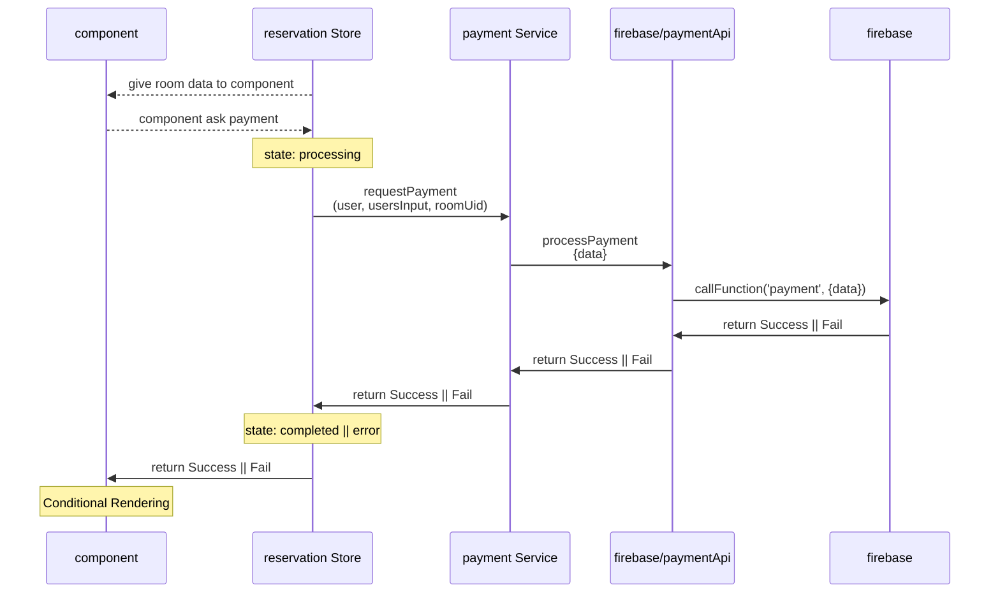

# request payment

## sequence diagram

[mermaid live](https://mermaid.live/edit#pako:eNp90lFv2jAQAOC_crqXdlJGQwIBrAopBPo4VeNtyotxjmA1sTPHrsYo_30OCRNSK_wUR9-d784-odAFIcOWfjtSgtaSl4bXuQK_Gm6sFLLhykIKvIXsQOJNOwuvvKTPZtUZQy2Zd26lVrC12nzhss41_FiTsluPpfgCrTu0l4Z2vKWnQaeN_Cw3tzJXPUjh-3IJKwat29XSvvbxzzvztHx0vkKQqnH2W49XF5wxX7wfQ9tpqgd9Krjl595lF7dm0BgtqG1vs9669cVtGAheVS9OiW4ajw9DEw8B9Hg4fXPNasg646fmRJccPj7ghcvqNmV2H2XXpu-hvtn0PvqhLYF-93NKgUGmVSG7HngFP6lQZKQqMcCaTM1l4d_PqQvL0R6ophyZ_yxoz11lc8zV2VPurN4elUBmjaMAjXblAdmeV63fucYP5Pr4_v_1t_tL6_oa4rfITvgHWRQmo3EchYtpHCeL8SRMAjwiGyfz0WwRR5N4Es6jMB5H5wD_XjKEo2QxnYazJIri2TwJp9MAS9OVPpxlSBVkMu2URTYJZ-d_sEz_pg)
