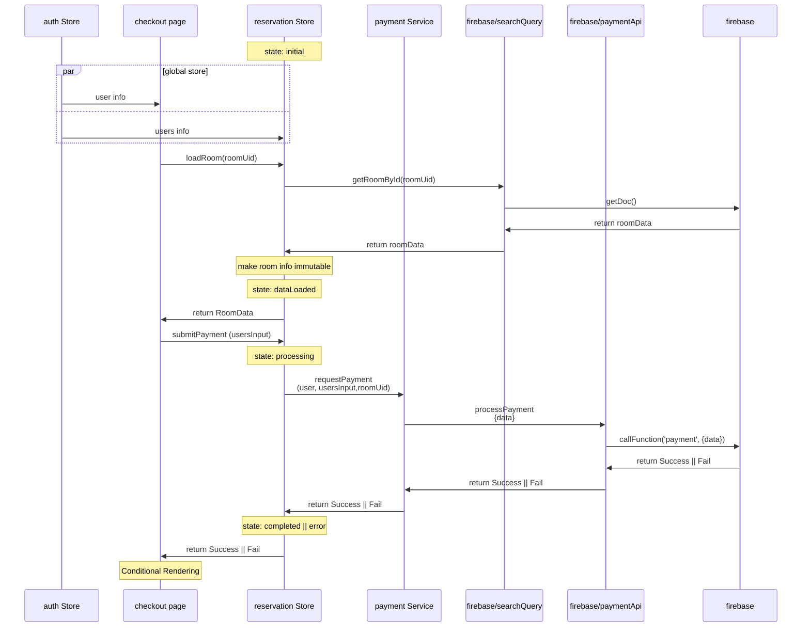

# reservation page

## sequence diagram

[mermaid live](https://mermaid.live/edit#pako:eNqNlF1v2jAUhv-K5ZuClLVAA4RoQtpaVZo0TRvcTdw49kmwmtipY1djlP_e44RkodBqvohi-znv-bK9p1wLoDHdqAqeHCgO95JlhhUbRXCUzFjJZcmUJYywijBnt2RttYFzIPEA3wJ_1M7iTnaB4Z4xUIF5ZlZq9Z5W6rmS7QrAyRppyS9Q4KlUGkhYBTcVMMO3vxyY3TmanaBH5S-lPCdFn9yoBvihLRD9DAYziEllmYWYSCWtZHlDdEIky3XCcoS6zPxg5NNyiTWKicPs0TbVzSZTgrzF-BGrehwo0UaTdFCumVhpXQwMfoiTYthGwmsGo8zAeuLr7pvoUUfNGhI1dK_5YNgsi8YW9Q1YZxTxdvfMsr4Vf2f3tFQFe4QaqDMhsiicZUkO5IO6CtT6jomB6KeS_Atn1Tk8r0jlkkLan8ejM2irWDo7_MBlaTSHqpIq67tMa5dPqNEKfk7MzbJRrRMKSM9B0JW3EUlrkaxT72vsfZKHhsvaLnCW5w9OcX8zBlfHQ3oVkAY-aU7WFWPtuBcnLy_kgcm8L5l-DKVv-ngRulgurosyBwvCs2CMNied-l9F39I7rYT0CeOVWYFQYOom0IAWYAomBb5Oe2-4oXYLBWxojL8CUuZyu8GH64AoPkt6vVOcxtY4CKjRLtvSOGV5hTNXYv3ah61bxcv-G_vVmuCUxnv6h8bj6Ho2D0eT0Xw2n4zHi3EY0B0uj-bXi-ntbDGfjMJptIjCQ0D_1grj63A0C2-jaTiJbsPpIgpoZnzkR1cG7y6YO-2UpfEkXESHV2ygwYU)