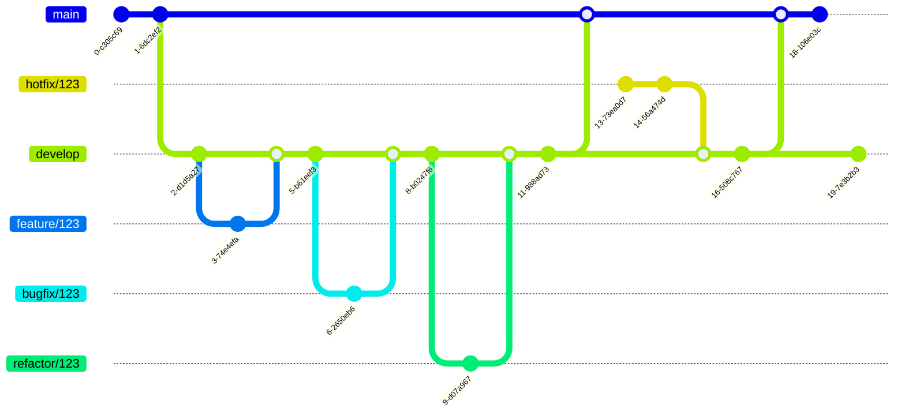

# git flow

## overview

## 브런치 종류

- `main`
	- 긴급 수정: `hotfix/`
		- `hotfix/security-vulnerability`

- `develop`
	- 기능 개발: `feature/`
		- `feature/login-system`
	- 디자인 변경:  `design/`
		- `design/landing-page-redesign`
	- 버그 수정: `bugfix/`
  	- `bugfix/blinking`
	- 리팩토링: `refactor/`
		- `refactor/improve-performance`
	- 문서: `docs/`
		- `docs/api-guide`
	- 테스트: `test/`
		- `test/integration-test`
	- 잡무: `chore/`
		- `chore/update-dependencies`
	- 코드 스타일 변경: `style/`
		- `style/lint-fixes`
	- 성능 개선 : `perf/`
  	- `perf/optimize-database`

- * release는 운용 안함
