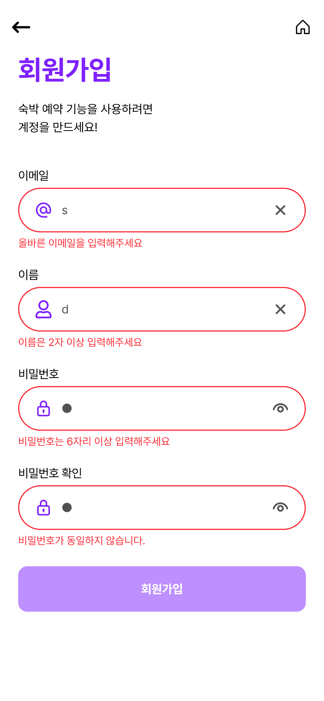

<style>
* {
  font-family: 'fira code', interop
}
section {
}

ul, ol {
  display: flex;
  flex-direction: column;
  align-items: flex-start;
  width: fit-content;
  margin: 0 auto;
}

/* 테이블 내부의 ul, ol 스타일 유지 */
table ul, table ol {
  display: block;
  width: auto;
  margin: 0;
  padding-left: 20px;
}

/* 네스팅된 ul, ol은 기본 블록 스타일 유지 */
ul ul, ul ol, ol ul, ol ol {
  display: block;
  margin-left: 20px; /* 들여쓰기 유지 */
  width: auto;
}
h1, h2, h3 {
  margin-bottom: 32px;
}


.header {
  position: absolute;
  top: 10px;
  left: 50%;
  transform: translateX(-50%);
  font-size: 20px;
  font-weight: bold;
  font-style: italic;
}

table { font-size: 12px; }

</style>


<br/>

###### 2팀:  정유진, 김석용, 김인배, 오초록, 한은혁

---

# 목차

1. 프로젝트 개요
2. 팀 구성 및 역할
3. 수행 절차 및 방법
4. 프로젝트 수행 경과
5. 자체 평가 의견
---

<div class="header">프로젝트 개요</div>

## 숙박 예약 앱 

- 숙박예약 앱 구성
- 회원가입 기능
- 검색 기능
- 찜하기
- 결제 기능 구성
- mobile-first

---
<div class="header">프로젝트 개요</div>

## 언어
- HTML5, CSS3, JS
- React
- Tailwind

---
<div class="header">프로젝트 개요</div>

## 프로젝트 관리

- discord
- github wiki
- github project (kanban)

---

<div class="header">프로젝트 개요</div>

## 활용 방안 및 기대 효과

- 실시간 예약 및 결제
- 검색 및 가격 비교
- 리뷰 및 평점 확인
- 예약 관리 및 일정 조율
---

## 팀 구성 및 역할


<table>
  <tr>
    <th>역할</th>
    <th>이름</th>
    <th>주요 업무</th>
  </tr>
  <tr>
    <td align="center">팀장</td>
    <td align="center"><a href="https://github.com/jadewisemann">정유진</a></td>
    <td>
      <ul>
        <li>형상 관리</li>
        <li>Commit · Coding Convention 관리</li>
        <li>문서 관리 및 배포 담당</li>
        <li>컴포넌트 로직 구현</li>
        <li>공통 컴포넌트(movie-card, card-section ...) 구현</li>
        <li>메인 페이지 및 찜한 영화 페이지 개발</li>
      </ul>
    </td>
  </tr>

  <tr>
    <td align="center">팀원</td>
    <td align="center"> <a href="#">김석용</a> </td>
    <td>
      <ul>
        <li>공통 컴포넌트 개발</li>
      </ul>
    </td>
  </tr>

  <tr>
    <td align="center">팀원</td>
    <td align="center"><a href="https://github.com/kib09">김인배</a></td>
    <td>
      <ul>
        <li>공통 컴포넌트(main-header ...) 제작 및 구현</li>
        <li>검색 결과 페이지 개발</li>
        <li>TMDB API 사용하여 추가 검색 기능 개발</li>
        <li>TMDB API ↔ IMDB API 핸들링 기능 구현</li>
      </ul>
    </td>
  </tr>

  <tr>
    <td align="center">팀원</td>
    <td align="center"><a href="https://github.com/choroc">오초록</a></td>
    <td>
      <ul>
        <li>프로젝트 목표 설정 및 진행 관리</li>
        <li>기획 및 전체 일정 관리</li>
        <li>디자인 및 와이어프레임 제작</li>
        <li>영화 정보 상세 페이지 개발</li>
        <li>공통 컴포넌트(swiper--over-ride ...) 제작 및 구현</li>
      </ul>
    </td>
  </tr>

  <tr>
    <td align="center">팀원</td>
    <td align="center"> <a href="#">한은혁</a> </td>
    <td>
      <ul>
        <li>서버 성능 개선</li>
      </ul>
    </td>
  </tr>
</table>

---
# 수행 절차 및 방법

- 25 03 04 - 03 13 : 기획, 컨벤션 협의 및 구성
- 25 03 14 - 03 20 : 공통 컴포넌트 개발 &  DB 구성
- 25 03 21 - 04 01 : 페이지 개발 및 데이터 연결, 테스트
- 25 04 02 - 04 04 : 배포 및 문서화 
---
<div class="header">수행 절차 및 방법</div>

## git flow 활용


---
<div class="header">수행 절차 및 방법</div>

## 컨벤션

- github wiki 활용
- eslint & prettier 사용
  - airbnb와 google의 스타일 가이드 참고

---

# 프로젝트 수행 경과

---

## crawling

---

<div class="header">프로젝트 수행 경과 / crawling </div>

### 타겟 선정

- 타겟은 로그인을 요구하지 않고 CAPTCHA를 운영하지 않는 여기어때
- 전국 9개의 지역마다 100개 씩 정보 수집 

---
<div class="header">프로젝트 수행 경과 / crawling </div>

### 크롤링 전략

- 대용량 데이터 처리에 적합한 python 활용 
  
- `lazy-loading`과 js를 활용한 렌더링이 존재
  - 정적 html parser로는 불가
  - 직접 방문후 스크래핑
    - `beautiful soup`과 `selenium`을 활용

---
<div class="header">프로젝트 수행 경과 / crawling </div>

### 스크랩

- 접근성을 위해 마련된 `aria-label` 을  css selector로 찾고
- 그 안에서 xpath를 기반으로 정보 식별하고 스크래핑

--- 

## db: firestore

---

<div class="header">프로젝트 수행 경과 / firestore </div>

### firestore

- firebase에서 제공하는 firestore 활용
- firestore => no sql => 콜력션과 문서로 이루어짐

---
<div class="header">프로젝트 수행 경과 / firestore </div>

### 유사 관계형 구현

- 서비스 특성상 관계적인 db 구성이 필요 했음
- 항목들에 uid를 할당하여 다른 db와의 연결 포인트를 구성

--- 
<div class="header">프로젝트 수행 경과 / firestore  </div>


---

## server: functions

---

<div class="header">프로젝트 수행 경과 / functions </div>

### 서버의 필요성

- 유저에게 포인트를 부여
- 예약 정보의 실효성 확인
- 결제 및 예약 내역을 저장

---
<div class="header">프로젝트 수행 경과 / functions </div>

### functions

- firebase의 서버리스 컴퓨팅 서비스 functions 활용
- 회원 가입시 포인트 증정
- 회원에게 포인트 부여
- 예약 검증 및 예약 데이터 저장

---
<div class="header">프로젝트 수행 경과 / functions </div>

### ex) 회원 가입시 포인트 증정

```js
const db = getFirestore();
const userRef = db.collection('users').doc(user.uid);

await userRef.set({
  ... user
  points: signupBonus,
});

// ...

export const giveSignupPoints = functions
  .region('asia-northeast3')
  .auth.user()
  .onCreate(giveSignupPointsHandler);
```
---

## style

---
<div class="header">프로젝트 수행 경과 / style </div>


- 컴포넌트 기반의 설계 => 컴포넌트 단에서 스타일링 처리
  - ~~CSS 전처리기~~

- 성능 이슈
  - ~~CSS in JS(styled components)~~

- 분리된 파일
  - ~~css module~~

- 나쁜 DX 
  - ~~vanilla extract~~ 
  
--- 
<div class="header">프로젝트 수행 경과 / style </div>

### tailwind V4
- 컴포넌트 기반의 설계에 적합
- 성능 이슈가 없음
- 하나의 파일에서 관리
- 우수한 DX

---
<div class="header">프로젝트 수행 경과 / style </div>

- 가능한 `@apply`를 사용하지 않기

- 반복되는 부분은 컴포넌트로 분리 or 동적으로 생성

---

## react V19

---
<div class="header">프로젝트 수행 경과 / react </div>

- `react-helmet-async` 의존성 제거 가능
  - 비동기적인 meta 요소 랜더링
    - 깜빡임
  - 사이드 이펙트

---

## 상태 관리 = zustand 

---
<div class="header">프로젝트 수행 경과 / 상태관리 </div>

- 간결한 상태 구현
- persist 등의 미들웨어 제공
  - local storage & session storage에 저장

---
<div class="header">프로젝트 수행 경과  / 상태관리 </div>

### persist 

- 로컬 저장소와 원격 저장소의 hydration이 가능

- `authStore`: 비동기적 인증 상태 확인
  - 프로텍트 라우팅 등 인증 상태에 의존하는 기능
     => 로딩 초기에 문제가 발생 (초기값은 언제나 null)

---
<div class="header">프로젝트 수행 경과 / 상태관리 / persist </div>

```js
const useAuthStore = create(
  persist(
    set => {
      listenAuthState(user => 
        // ...
      ),
      // ...  
    } ,{
      name: 'auth-storage',
      getStorage: () => localStorage,
      partialize: state => ({
        user: state.user,
      }),
      onRehydrateStorage: () => state => {
        if (state) {
          state.isLoading = false;
        }
      },
    },
  )
)
```
---
<div class="header">프로젝트 수행 경과 / 상태관리 / persist </div>

####  wishlist

- 로그인 없이 wishlist를 로컬에 저장
- 로그인을 하면 해당 내역을 원격에 반영

---
<div class="header">프로젝트 수행 경과 / 상태관리 </div>

### 결제

- 클로저 내부에서 관리되는 전역 스토어 이용
  - 더 나은 보안성
- zustand를 결제 미들웨어로 활용
  - store가 서버에서의 정보를 가지고 있다가
    결제 요청시  사용자 정보와 함께 서버에 요청

---
<div class="header">프로젝트 수행 경과 / 상태관리 / 결제</div>

#### side effect

- 사용자가 결제 페이지까지 진입했다가
  취소하고 다른 숙소를 예약한다면? 
- 사용자가 여러개의 창에서 결제를 시도한다면?
- 등등등

---
<div class="header">프로젝트 수행 경과 / 상태관리 / 결제</div>

#### FSM: Finite State Machine

- 유한 개수의 상태를 가짐
- 특정 조건에서만 상태간의 전이가 일어남
- 상태 간의 전이가 명확하게 한정되어 있음

---


- 전구의 상태
  - OFF (꺼짐)
  - ON (켜짐)
  - BROKEN (고장남)

- 전환 조건
  - switch_on 
  - switch_off 
  - break_bulb 

---
<div class="header">프로젝트 수행 경과 / 상태관리 / 결제</div>

```js
// reservation store
canTransitionTo: nextState => {
  const { currentState } = get();
  const validTransitions = {
    [STATE.IDLE]: [STATE.DATA_LOADED, STATE.ERROR],
    [STATE.DATA_LOADED]: [STATE.PROCESSING, STATE.IDLE, STATE.ERROR],
    [STATE.PROCESSING]: [STATE.COMPLETED, STATE.ERROR],
    [STATE.COMPLETED]: [STATE.IDLE],
    [STATE.ERROR]: [STATE.IDLE, STATE.DATA_LOADED],
  };
  return validTransitions[currentState]?.includes(nextState) || false;
}
```

---
<div class="header">프로젝트 수행 경과 / 상태관리 / 결제</div>

```js
submitPayment: async userInput => {
  // ...

  if (!canTransitionTo(STATE.PROCESSING)) {
    console.error(
      `${ERR_MSG.NOT_VALID_TRANSITION}: ${currentState} => ${STATE.PROCESSING}`,
    );
    return { success: false, error: ERR_MSG.NOT_VALID_TRANSITION };
  }

  // 결제 요청 제출
}
```

---
<div class="header">프로젝트 수행 경과 / 상태관리 / 결제</div>

- 여전히 탭 서로 다른 탭에서의 결제 요청은 해결 불가
  - `persist`로 탭 별로 관리되는 session storage를 사용

---


---
<div class="header">프로젝트 수행 경과 / 상태관리 </div>

### modal && toast

- `react portal`을 사용해서 렌더링
  - 부모 컨테이너에 영향을 받지 않고 독립적으로 랜더링
    - side-effect에서 비교적 자유로움

- 전역 상태로 열고 닫기를 관리

--- 
<div class="header">프로젝트 수행 경과 / 상태관리  / modal & toast </div>

#### modal


- 전역 상태와 지역 상태를 나누고렌더링은 지역 상태에만 의존
  - 단방향의 상태 변화
  - 리렌더링 최적화
  
- 변경된 정보의 외부의 전달은 전역 상태 저장소 활용

---
<div class="header">프로젝트 수행 경과 / 상태관리  / modal & toast </div>


---
<div class="header">프로젝트 수행 경과 / 상태관리  / modal & toast </div>

#### toast

- 매번 상태를 초기화 => 인스턴스처럼 사용

```js
const useToastStore = create(set => ({
  message: '',
  className: '',
  showToast: (msg, className = '') => {
    set({ message: msg, className });
    setTimeout(() => set({ message: '', className: '' }), 2000);
  },
}));
```
---
<div class="header">프로젝트 수행 경과 / 상태관리  </div>

### dark mode

---
<div class="header">프로젝트 수행 경과 / 상태관리 / dark mode </div>

#### tailwind, `dark:`

```jsx
<html>
  <body class="dark">
    <div class="bg-white dark:bg-black">
      <!-- ... -->
    </div>
  </body>
</html>
```

```jsx
className = '
  border-1 border-neutral-300 bg-white text-neutral-600
  hover:border-neutral-400 
  dark:border-neutral-400 dark:bg-black dark:text-neutral-400'
'
```

---

#### `darkModeStore`

```jsx
const getInitialTheme = () => {
  const isBrowserDarkMode = window.matchMedia(
    '(prefers-color-scheme: dark)',
  ).matches;

  const storedTheme = localStorage.getItem('theme');

  return storedTheme
    ? JSON.parse(storedTheme)
    : isBrowserDarkMode
      ? 'dark'
      : '';
};
```

---

## route: `react-router-dom`

---
<div class="header">프로젝트 수행 경과 / route </div>

### public route

```jsx
<Route element={<PublicRoute />}>
  <Route path='/login' element={<LoginPage />} />
  <Route path='/signup' element={<SignupPage />} />
  <Route path='/find-password' element={<FindPasswordPage />} />
</Route>
```

```jsx
if (user) {
  return <Navigate to='/' replace />;
}

return <Outlet />;
```
---
<div class="header">프로젝트 수행 경과 / route </div>

### private routing

```jsx
<Route element={<PrivateRoute />}>
  <Route path='/mypage' element={<MyPage />} />
  <Route path='/checkout/:roomId' element={<CheckoutPage />} />
</Route>

```

```jsx
  if (!user) {
    return <Navigate to='/login' state={{ from: location }} replace />;
  }

  return <Outlet />;
```
---
## page

---
<div class="header">프로젝트 수행 경과 / page / main </div>

<style>

.container {
  display: grid; 
  grid-template-columns: repeat(3, auto); 
  gap: 50px;
  justify-content: center;
  width: fit-content;
  margin: 0 auto;
}
</style>

<div class="container">
  
  
  
</div>

---

<div class="header">프로젝트 수행 경과 / page / search-result </div>


<div class="container">
  
  
  
</div>

---
<div class="header">프로젝트 수행 경과 / page / wishlist </div>

<div class="container">
  
  
</div>

---

<div class="header">프로젝트 수행 경과 / page / login </div>

<div class="container">
  
  
  
</div>

---
<div class="header">프로젝트 수행 경과 / page / signup </div>

<div class="container">
  
  
  
</div>

--- 
<div class="header">프로젝트 수행 경과 / page / details </div>

<div class="container">
  
  
  
</div>

--- 
<div class="header">프로젝트 수행 경과 / page / checkout </div>

<div class="container">
  
  
  

</div>

---
<div class="header">프로젝트 수행 경과 / page / reservation-detail </div>

<div class="container">
  
  
  
</div>

---

# 자체 평가 의견
---
