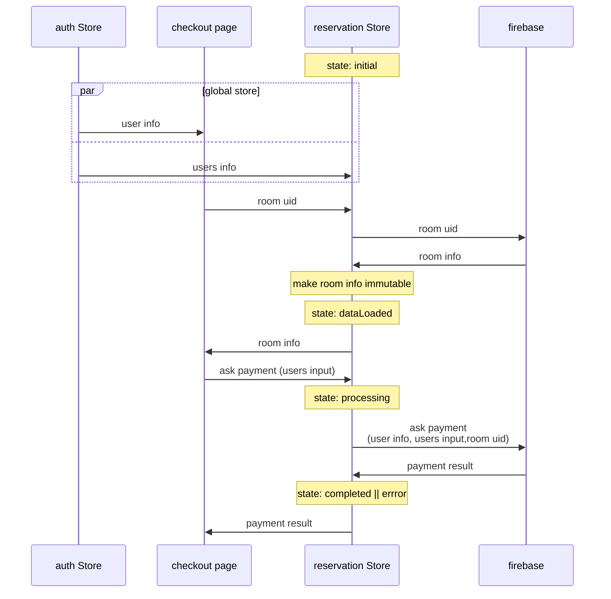

```mermaid
sequenceDiagram
    participant auth Store
    participant checkout page
    Note over reservation Store: state: initial
    par global store
        auth Store ->> checkout page : user info
    and 
        auth Store ->> reservation Store : users info
    end
    checkout page ->> reservation Store : room uid  
    reservation Store ->> firebase: room uid 
    firebase ->> reservation Store : room info
    Note over reservation Store : make room info immutable 
    Note over reservation Store : state: dataLoaded
    reservation Store ->> checkout page : room info  
    checkout page ->> reservation Store : ask payment (users input)
    Note over reservation Store : state: processing
    reservation Store ->> firebase : ask payment<br/> (user info, users input,room uid)
    firebase ->> reservation Store : payment result
    Note over reservation Store : state: completed || errror
    reservation Store ->> checkout page : payment result
```
